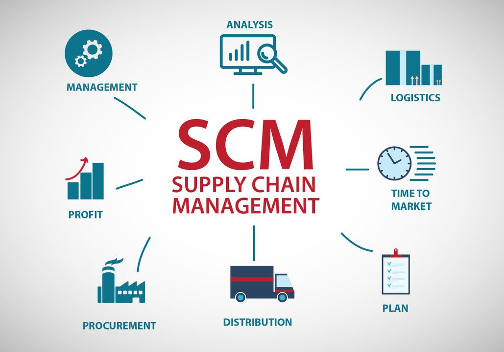

::: {custom-style="WidthText"}
За последние годы стабильностью и развитием БРИКС можно как восхищаться, так и есть проблемы, над которыми следует задуматься. Различные принятые решения на разных уровнях жизни каждого государства непременно затрагивают само государство, экономику, политику, жизнь людей, новые технологии и новые вызовы, особенно многополярность.

Переход в цифровую экономику происходит не в один день – это очень долгий и затруднительный процесс. Он затрагивает не только страны БРИКС, но и самих людей. Никто и не мог представить, что все, что нам нужно будет, находится в одном смартфоне, где есть вся информация: данные, пароли и личная конфиденциальная информация обо всем, что мы сможем найти, лишь следует сделать пару действий и сделать пару кликов и поисков. Структура стран БРИКС заключается в объединении и интеграции между инвестициями в человеческие нужды и технологическим процессом [1, 2].

На календаре 2025 год, в предыдущем году состав участников увеличился на 5 значительных государств-стран, которые в большой степени улучшат работу и взаимодействие между странами БРИКС, а именно: ОАЭ, Саудовская Аравия, Египет, Эфиопия и Иран. На сегодняшний день на них приходится около 39% в сфере добычи полезных ископаемых, 29% мирового ВВП, 44% сотрудничества и численности населения, а также 26% самой мировой торговли.

БРИКС как магнитом привлекает свое внимание страны южного направления, что говорит о возможных будущих перспективах, взаимодействии и развитии новых технологий и новых вызовов. Данное сообщество привыкли называть как «антизападное», так как оно хочет противостоять мировому порядку, который находится под давлением и пристальным вниманием Соединенных Штатов Америки [3].

Основными направлениями БРИКС являются вызовы, которые диктуют условия жизни. За этим стоит цифровизация экономики и многополярность. Беспокойство никуда не уходит, оно возрастает с каждым днем у всех, и возникают вопросы, а ответов мало, если упустить нужный момент. Для всех было не секретом и сюрпризом развитие искусственного интеллекта, нейросетей и автоматизация рабочего процесса. Это две стороны одной медали, с одной стороны, это улучшает, облегчает и делает эффективнее работу, а с другой стороны, многие люди, в особенности на заводах и фабриках, вынуждены привыкнуть к новым технологиям или потерять работу, и часть работы могут заменить каким-либо оборудованием или роботом. Такой практикой пользуется Китай и Америка. Но все заменить на компьютер, ИИ и нейросети невозможно, тогда не будет смысла человеческой жизни, развития технологий, будущего и человеческого блага на жизнь [4].

Цифровые технологии затрагивают также прежде всего финансовый сектор, расчеты и платежи, многослойность платежей между странами, глубину процесса и эффективность работы. Айти-специалисты также развиваются, чтоб адаптироваться быстрее и эффективнее справляться с новыми вызовами. Но не стоит забывать про хакерские атаки, мошенничество и других недоброжелателей. Развитие цифровизации идет во всех сферах жизни, неважно, что это будет – политика, экономика, медицина, военно-промышленный комплекс или просто жизнь обычных людей. Цель БРИКС и входящих государств в альянс – обеспечить безопасность каждого государства всевозможной защитой на всех уровнях жизни людей, максимально открыто, но не агрессивно отвечать на вызовы цифровизации и быть максимально сконцентрированным на происходящих проблемах, если такие есть [5].

Новые участники альянса открывают возможности для инвестиций в будущее, финансовый сектор, безопасность и развитие новых технологий, транспорт, военную структуру и возможности для обсуждения другого мнения, менталитета другой страны и взгляд со стороны на всемирную ситуацию в целом. Новобранцев объединяют с БРИКС возможности, обсуждения, новые цели, развитие, сотрудничество в проектах для инвестиционного климата будущего и человеческих ресурсов. Например, можно отметить сельскохозяйственный и медицинский секторы, где цифровизация вышла на другой уровень. Это можно отнести больше к положительным факторам, чем к негативным [6].

Суверенитет цифровизации альянса является также очень важной целью для сокращения цифрового разрыва и адаптирования цифровой экономики. БРИКС – это страны единомышленники, с общими целями и благами для противостояния мировому порядку и стабилизации человеческого всеобщего мнения и жизни в будущем. Накопительный процесс длится долго, проблемы возникают каждый день и решать их нужно скоординировано и спокойно, только за решением проблем идет развитие и улучшение жизни.

Если подвести итог, замедление развития БРИКС заключается в отставании стран, у которых по тем или иным причинам нет возможности более эффективного развития экономики и цифровизации, например, как у Российской Федерации и ее взаимодействия с Китайской Народной Республикой. Если все страны в альянсе также будут взаимодействовать как вышеупомянутые, и также все друг другу будут помогать, то процесс перехода в цифровую экономику и финансы будет происходить быстрее, а значит жизнь людей и государств будет лучше [7].
:::

::: {custom-style="WidthText"}
Другой областью применения является управление цепями поставок (рис. 1). Моделирование позволяет анализировать работу всей цепочки поставок, от поставщиков до конечных потребителей, и оптимизировать ее работу. Это может включать в себя планирование запасов, выбор маршрутов доставки, управление складами и многое другое.
:::

{custom-style="PictureText"}

[Рисунок 1 – Моделирование при помощи управления цепями поставок]{custom-style="DescriptionPictureText"}

::: {custom-style="WidthText"}
Моделирование также широко используется в медицине. Например, с помощью компьютерных моделей можно изучать распространение инфекционных заболеваний, анализировать эффективность лекарств и разрабатывать новые методы лечения.

В области финансов моделирование применяется для анализа рисков и принятия решений о инвестициях. Модели помогают оценить вероятность возникновения неблагоприятных событий, таких как изменение курсов валют или цен на акции, и принять соответствующие меры (Табл. 1).
:::

[Таблица 1 – Неизменяемые параметры проекта по производству «A»]{custom-style="DescriptionTableText"}

|Показатели|Наиболее вероятное значение|
|:----:|:----:|
|Постоянные затраты – F|500|
|Амортизация – A|100|
|Налог на прибыль – T|60%|
|Норма дисконта – r|10%|
|Срок проекта – n|5|
|Начальные инвестиции – l|2000|
{custom-style="TableText"}

::: {custom-style="WidthText"}
Большинство устойчивых методов базируется на решении задачи (1).
:::

$$
\sum_i \varphi\left(y^i - \Theta x^i\right) \to \min \quad\quad\quad\quad \tag{1} 
$$ {custom-style="Equation"}

::: {custom-style="WidthText"}
где \( x \) — вектор независимых переменных, \( y \) — результирующая переменная (отклик), \( \Theta \) — вектор параметров, \( \varphi \) — локально выпуклая функция.
:::